# OLED Window Guard

**Keep your windows moving. Care for your OLED.**

Automatically shift and rotate application windows to reduce how long content stays in one place.

A native macOS menu-bar app that periodically moves eligible windows on selected displays. Built with SwiftUI, AppKit, public Accessibility APIs and Core Graphics. No dependencies, screen capture, telemetry, window-title logging, private window-server APIs.

**Stable release: 0.1.23.** Geometry and lifecycle logic have automated tests; the real Accessibility permission flow and application-specific behavior also require the manual checks in [docs/TESTING.md](docs/TESTING.md).

## Download

[Download for macOS](https://github.com/baddison2005/oled-window-guard/releases/latest) · [Report an issue](https://github.com/baddison2005/oled-window-guard/issues)

This release is free to use. Future releases or additional features may be paid.
Source is publicly viewable with copyright reserved; see [LICENSE](LICENSE).
The app currently moves windows; display/window dimming and heatmaps are not included.

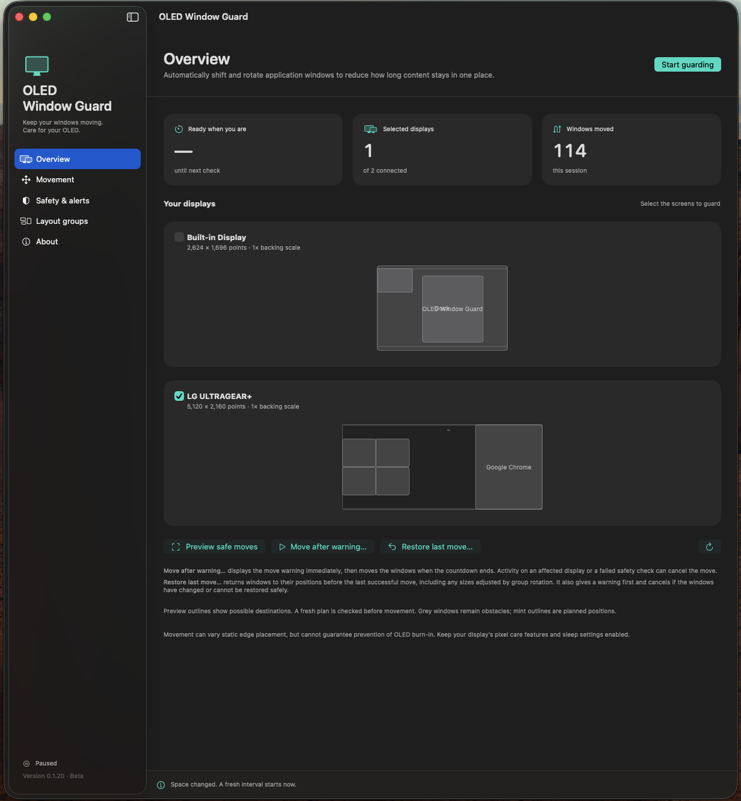

## In action

Real desktop recordings on a 5120 × 2160 display. Windows are repositioned directly;
the GIFs do not imply smooth animated paths or guaranteed burn-in prevention.

**Shift position** — varied distances and directions, while preserving window sizes.

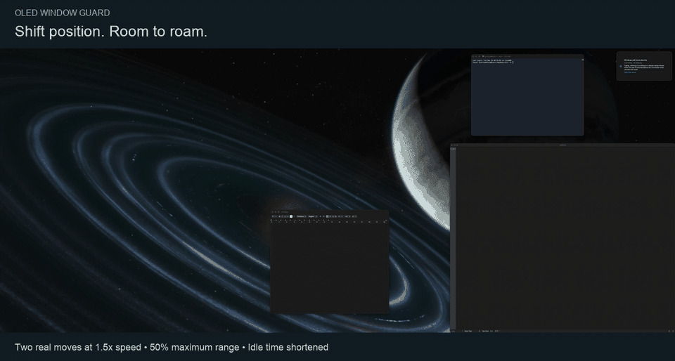

**Window Layouts group rotation** — coordinated destinations within a saved group.

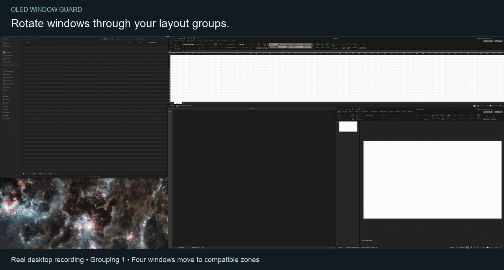

**Swap positions** — keep adjacent, similarly sized windows together.

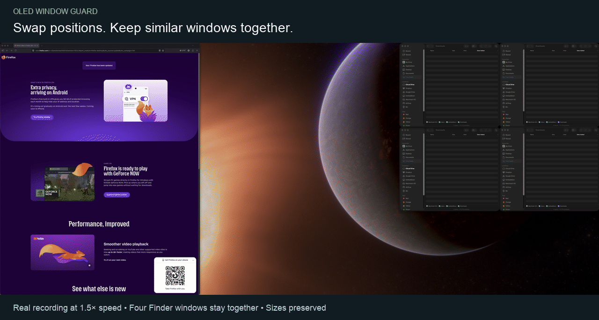

**Restore last move** — return to the preceding arrangement after a warning.

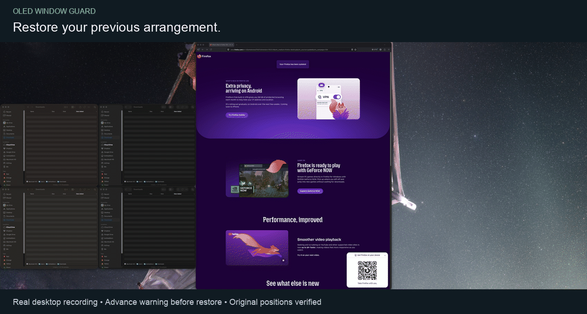

## Explore the app

Choose a movement style, preview its destinations, and control when moves are allowed.
These screenshots were captured during beta testing; version labels may differ from the current release.
Click an image to view it at full size.

| Shift position | Grouped swaps |
| --- | --- |
| 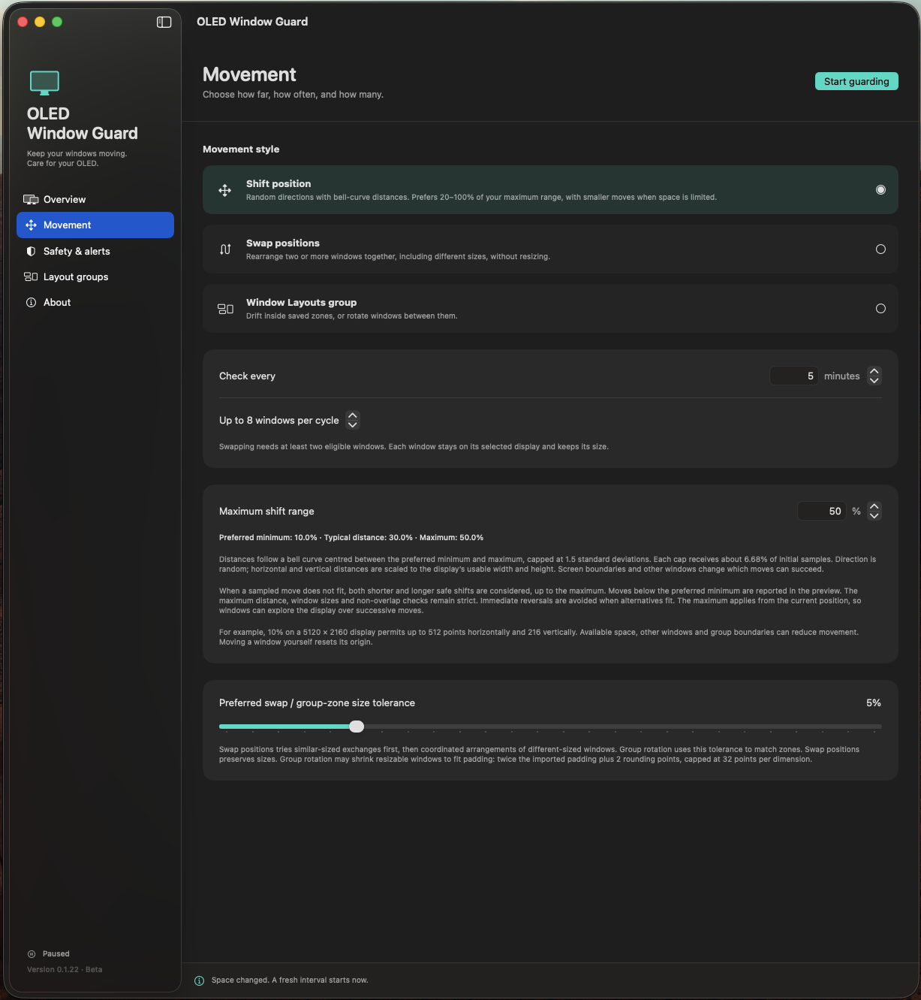 | 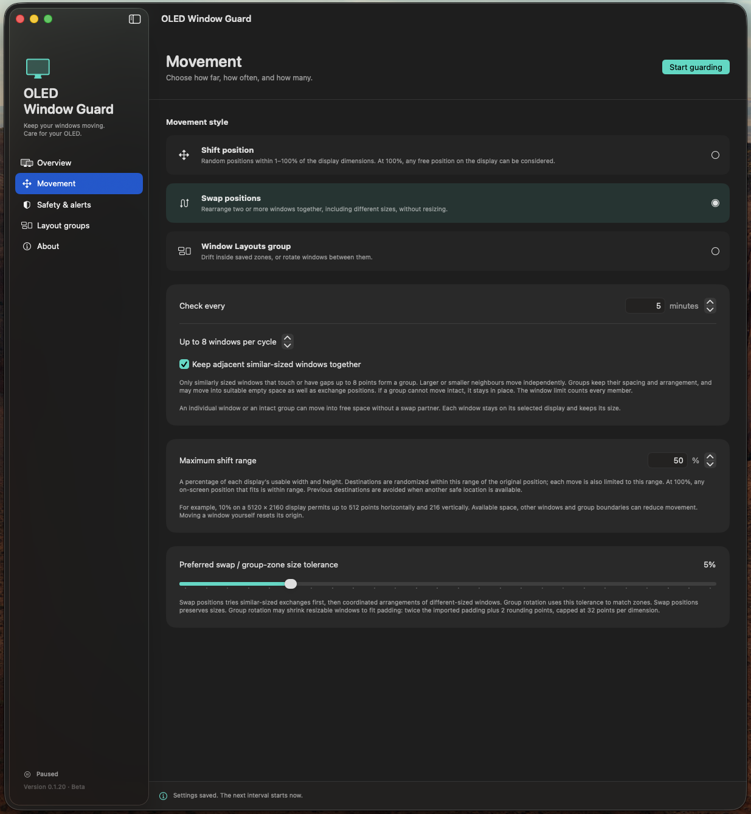 |

| Window Layouts integration | Safety and warnings |
| --- | --- |
| 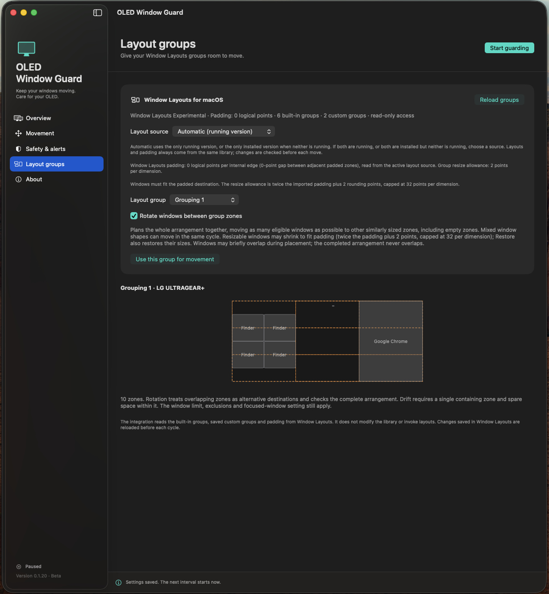 | 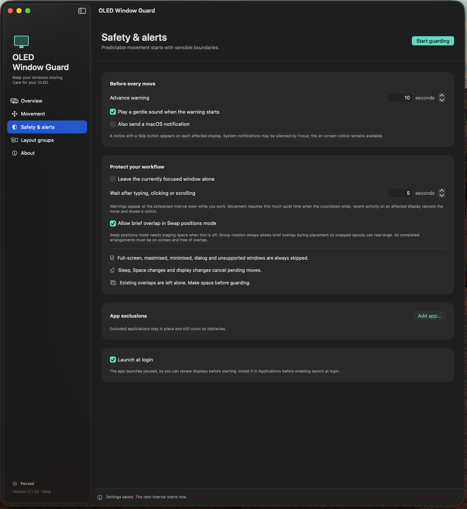 |

<details>
<summary>Preview, menu bar, group movement and update controls</summary>

Preview safe destinations before moving:

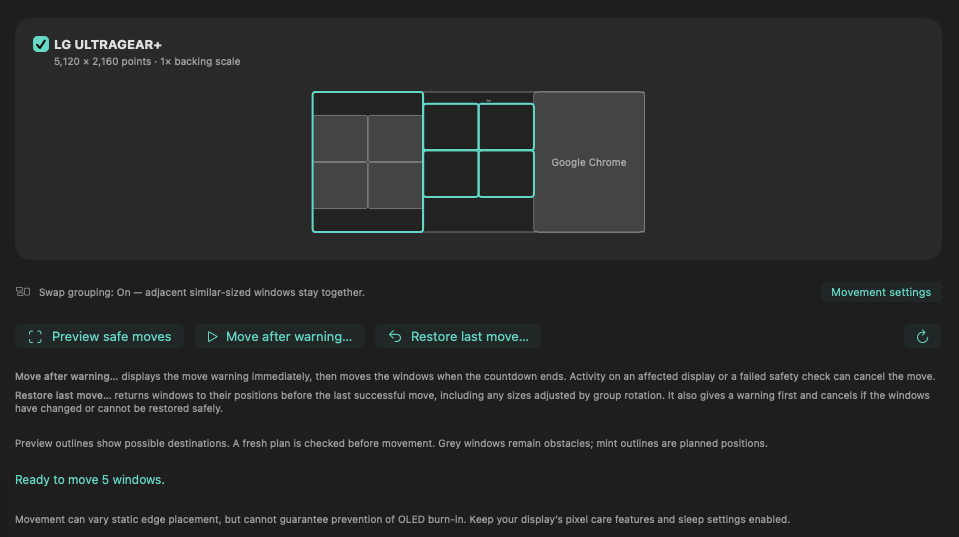

Quick controls from the menu bar:

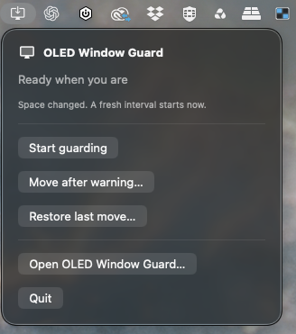

Rotate between group zones or drift within them:

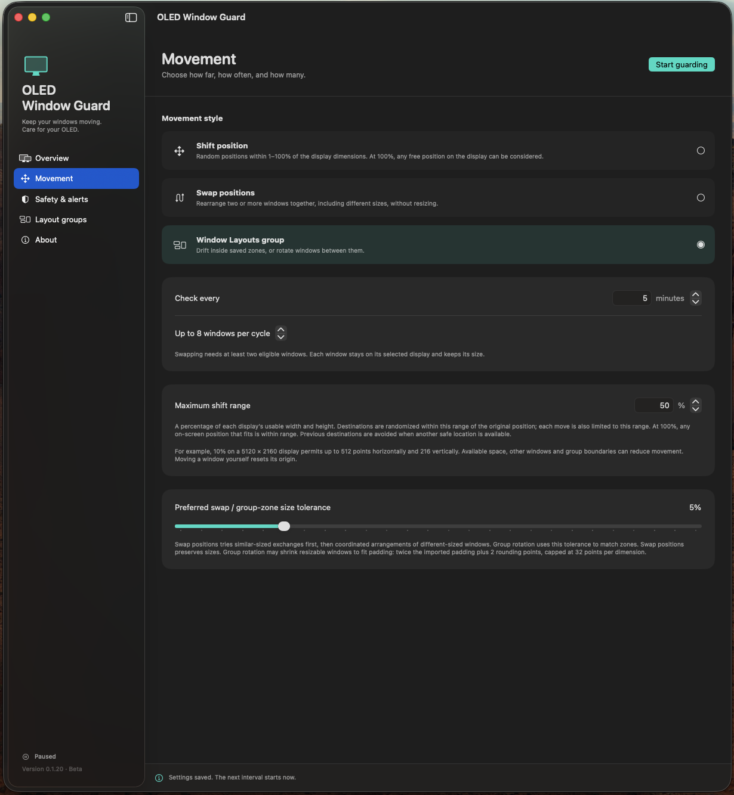

Version information and manual update checks:

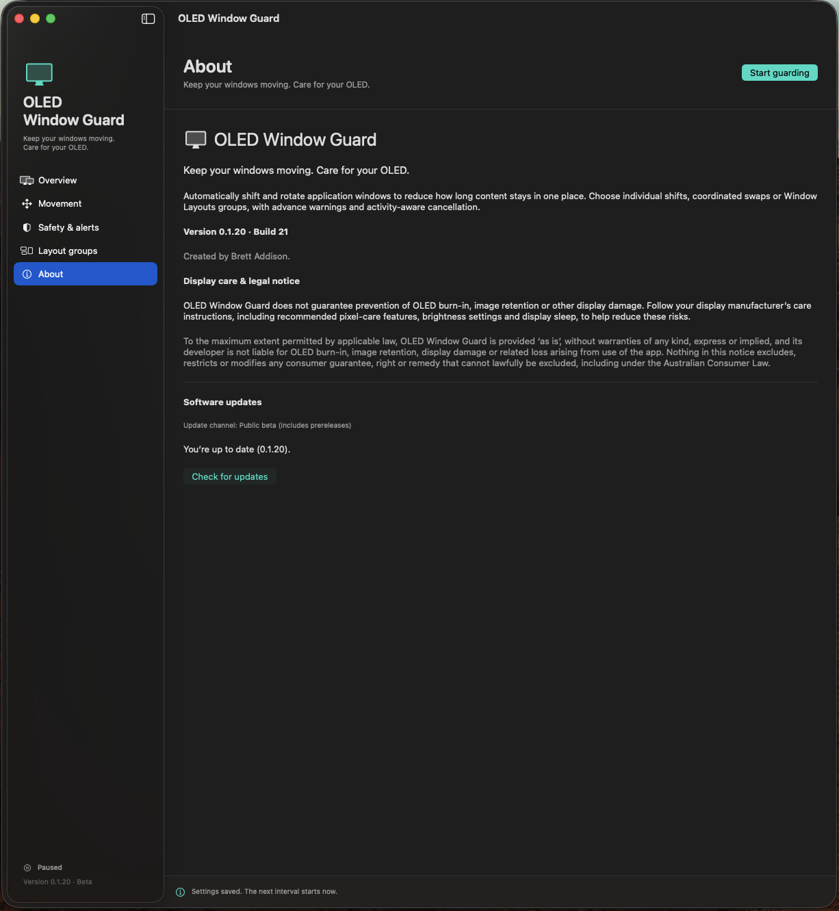

</details>

## Features

- Overview shows the current Swap grouping status and a shortcut to Movement settings. Descriptions under the action buttons explain immediate warning countdowns and restoring previous positions and adjusted sizes, including cancellation checks.
- **Keep adjacent similar-sized windows together:** optional in Swap positions. Windows sharing an edge or separated by up to eight points form a group using the size tolerance. Differently sized neighbours remain independent. Groups and individual windows can move into suitable empty space without a swap partner. Groups preserve relative positions and spacing, count each member toward the window limit, and remain stationary if a member is excluded or a safe intact swap cannot be found. The planner uses each group's bounding rectangle, so irregular groups may have fewer available moves.
- **About:** “Keep your windows moving. Care for your OLED.”, app description, version/build and manual GitHub update controls. The stable app checks stable GitHub releases; earlier beta builds can also find this release.
- Select one or more connected monitors, remembered by display UUID. Newly connected monitors are never selected automatically.
- Set a check interval from 1 to 240 minutes and a 3–60 second advance warning.
- **Shift position:** random directions with a clamped Gaussian movement magnitude. For maximum range M, the preferred minimum is 0.2M, the mean is 0.6M, and sigma is 0.8M/3. Initial samples land on each cap about 6.68% of the time; window geometry filters successful moves. Distances use display-normalised coordinates (horizontal displacement divided by usable width, vertical displacement divided by usable height), so the maximum bounds the combined movement magnitude. The maximum applies from the current position, allowing successive moves to explore the display. Safe fallback distances can be shorter or longer than the sampled distance, up to the maximum. Crowded displays progressively allow smaller shifts, reported in the preview, while preserving window sizes, screen containment and non-overlap. Previous destinations are avoided when alternatives fit. Group-zone drift retains its existing sampling.
- **Swap positions:** coordinate two or more windows on the same monitor, preserving their sizes. Similar-sized exchanges are tried first, then mixed-size arrangements when they can move more windows. No predefined zones are required. For example, a two-thirds-width window can trade sides with a smaller window, whose vertical position can vary in the remaining third. Exclusions and the maximum window count still apply.
- **Window Layouts groups:** built-in Halves, Horizontal Halves, Vertical Halves, Quarters, Thirds and Two Thirds, plus saved custom groups. Drift inside a containing zone or jointly rearrange mixed window shapes among compatible zones, including empty destinations. Rotation prioritizes moving all eligible windows within the configured limit and checks the completed arrangement for collisions. Overlapping group zones are alternative placements. Window menu commands such as maximise are actions, not layout groups.
- Nonactivating warning panels on affected monitors, with a Skip button; optional Glass sound and macOS notification. These do not raise or activate the windows being moved.
- Pause, preview, warn-and-move, and restore the last verified move. Restore also warns and cancels if the desktop has changed.
- Exclude apps and avoid the focused window by default. Scheduled warnings appear even during activity. Typing is attributed to displays intersecting the focused window; clicking, dragging and scrolling to the event's display. Only activity on affected displays cancels the pending move. Unknown keyboard focus is treated conservatively as activity on all displays. A brief cancellation notice appears and the next regular interval begins. The quiet period also considers activity before the warning. Only event kind, geometry and timestamps are used; keystroke contents are never read or stored.
- Suspend on sleep / inactive session; cancel pending movement on Space or monitor changes; always start a fresh interval. No burst of catch-up movements after waking.
- Launch at login using Service Management. Always launch paused for explicit review.

## Important behavior

Group rotation recognizes current zone membership with up to the imported padding plus two logical points of source-edge discrepancy, capped at 32 points, accommodating snapped windows whose apps round position and size differently. This tolerance applies only to the source zone. Group rotation may shrink a resizable window by up to twice the imported padding plus two logical points per dimension, capped at 32 points to fit a destination. Destination containment, screen boundaries and final collision checks remain exact. Each size and position write is verified separately; Restore includes original sizes. On a 1× display, points and pixels are equal.

Full-screen, maximised, minimised, modal, unsupported, ambiguous and off-screen/spanning windows are skipped. Already-overlapping windows remain obstacles and are not rearranged. There must be room for drift: a perfectly packed display may have no safe moves. Skipping is an expected outcome.

In **Swap positions** mode, the default policy checks intermediate positions too and requires a free staging rectangle. The optional overlap setting relaxes that requirement. **Group rotation** always permits brief overlap during placement so tightly snapped layouts can rearrange without staging space. macOS exposes separate position writes, not atomic swaps. All final destinations must be non-overlapping and contained in the usable monitor area. Only group rotation permits the bounded rounding adjustment described above; other modes preserve sizes. Non-resizable windows and adjustments over the padding-derived limit are rejected. Position writes do not animate a path. Group assignment searches up to 50,000 states, prioritizing the number moved; exceptionally complex arrangements may return a safe partial result.

Free-form swaps likewise use a bounded 50,000-state search over screen edges, window edges, reflected positions and vertical offsets. They check every final rectangle and, when brief overlap is disabled, require a safe sequence of intermediate placements. This search may skip a complex arrangement even if another placement exists. Shift position does not jointly swap occupied space: use Swap positions for that purpose. Existing movement settings and the saved internal `drift` mode identifier remain compatible with the renamed UI.

Every pending plan is revalidated on its affected displays after the warning and before each move. Windows that span onto those displays remain collision obstacles; unrelated activity on other displays does not cancel the plan. The app reads back positions after each step and after settling. A failed or changed window pauses guarding and triggers best-effort safe reversal of completed steps. A user-moved or closed window is never forcefully restored. macOS applications may apply their own positioning rules; absolute guarantees against concurrent external changes are not possible.

Percentage distances use each display's usable logical width and height, independently of backing scale. A 10% range on a 5120 × 2160 usable area permits up to 512 points horizontally and 216 vertically. For Shift position, the combined normalised movement magnitude also cannot exceed the selected range. This controls geometric movement, not a validated protection level. Existing settings migrate to 10% while preserving other preferences. Legacy pixel fields are retained for decoding compatibility but no longer control movement. Collisions, screen boundaries and group boundaries can substantially reduce the available distance.

Small moves mainly vary static edge placement. Large static areas inside a window, menu bars, the Dock and desktop elements may remain unchanged. This app cannot guarantee burn-in prevention and does not replace brightness management, display sleep or manufacturer pixel-care routines.

## Install and run

Requires macOS 14.6 or later. Release builds support Apple silicon and Intel.

1. Download the DMG from [GitHub Releases](https://github.com/baddison2005/oled-window-guard/releases), open it and drag **OLED Window Guard.app** onto **Applications**. A ZIP download is also available.
2. Open the app. Grant **Accessibility** access using its button and System Settings → Privacy & Security → Accessibility. Relaunch if macOS requires it.
3. Select the monitors to guard, choose the movement style and settings, and preview available moves.
4. Select **Start guarding**. The app also remains accessible from the menu bar when its window is closed.

Quit any development or older copy before opening the installed app. A second copy exits to prevent competing movement controllers.

If Accessibility is already switched on but the app reports that access is denied, see the [permission repair instructions](docs/DISTRIBUTION.md#if-accessibility-is-enabled-but-the-app-still-reports-denied). An old development signature can leave a stale permission entry; toggling its switch alone may not fix it. Debug builds now have a separate Accessibility identity.

The app does not request Screen Recording or Input Monitoring. Public window metadata and Accessibility geometry are used without taking screen images. Window lists may be incomplete for apps with nonstandard Accessibility support; such windows are conservatively treated as obstacles when their geometry is available.

## Build and test

Open `OLEDWindowGuard.xcodeproj` with Xcode 26.6, or:

```sh
xcodebuild build -project OLEDWindowGuard.xcodeproj -scheme OLEDWindowGuard \
  -derivedDataPath build CODE_SIGNING_ALLOWED=NO
./Scripts/test.sh
```

Tests cover geometric boundaries, mixed monitor scales and negative coordinates, per-move bounded roaming, Gaussian sampling, exclusions, swap staging, multi-window rotations, final collisions, group membership, the existing Window Layouts schema, stale-plan rejection and timer state. Randomized cases also validate every intermediate position.

## Persistence and integration

Layout groups has an Automatic / Window Layouts / Window Layouts Experimental source selector. Automatic chooses the only running version, or the only installed version when neither runs. Ambiguity requires an explicit choice. The selected source supplies both custom layouts and padding for all groups, including built-ins. Standard and Experimental use separate Application Support folders with those exact app names. Experimental schema 6 adds settings unrelated to the imported geometry. The active source and padding are displayed. An unreadable library disables group availability instead of substituting zero padding; source/group/padding changes during a countdown cancel it.

Padding is per internal edge: four points on each adjacent zone produces an eight-point gap. A window must fit the padded destination, allowing only the padding-derived shrink allowance. A window laid out with a different padding value may need to be reapplied using the chosen Window Layouts version first.

Own preferences: `~/Library/Application Support/OLED Window Guard/settings.json`, written atomically. Corrupt settings load safe defaults and remain untouched until a setting is changed. Running state, window references and undo history are memory-only.

Window Layouts source: `~/Library/Application Support/Window Layouts/layout-library.json`, read only when `com.astrobrett.WindowLayouts` is installed. Supports schema versions 1–6, custom groups and internal-edge padding. Groups contain layout rectangles, not persistent app assignments. Rotation requires a containing source zone and a different similarly sized destination zone; multiple containing zones are supported. Drift requires exactly one containing zone. Saving changes in Window Layouts updates the next cycle. Unknown schema versions and malformed geometry are rejected.

## Distribution

See [docs/DISTRIBUTION.md](docs/DISTRIBUTION.md). The App Sandbox is intentionally disabled because the core feature controls other applications through Accessibility. Release builds use Hardened Runtime, Developer ID signing, notarization and stapling. No Mac App Store submission is included.
